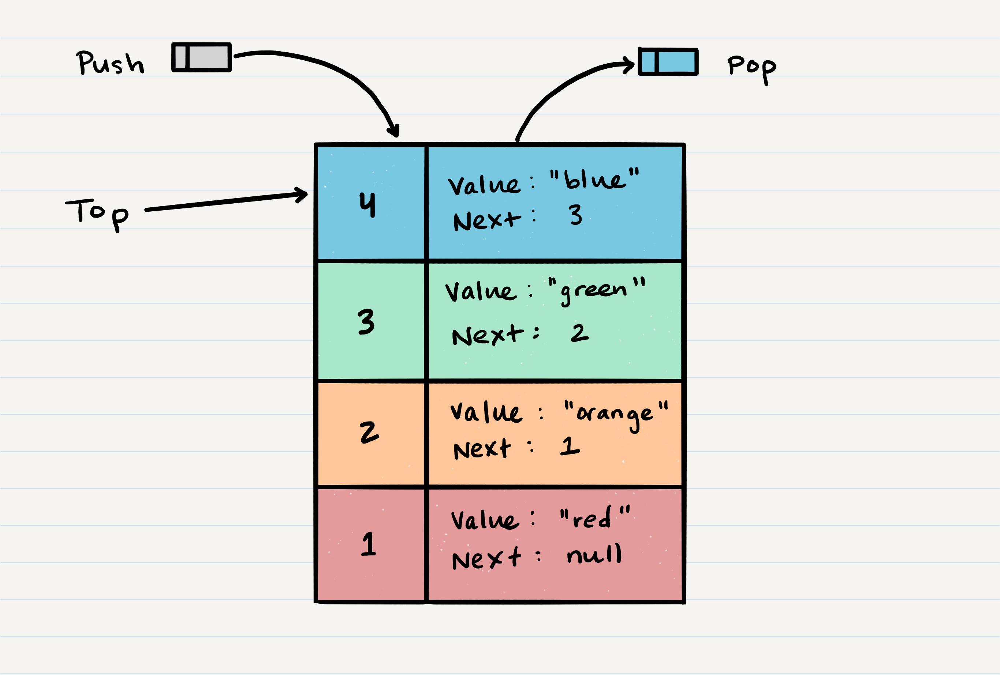

# 10 - Stacks and Queues

## Introduction to Stacks

Like linked lists, a stack is a data structure that consists of node. However, unlike a linked list, stack nodes can only ever reference the next node in the stack - not the previous one.

There are several common terms that are used when working with stacks.

- **Push** - Nodes or items that are put into the stack are pushed
- **Pop** - Nodes or items that are removed from the stack are popped. When you attempt to pop an empty stack an exception will be raised.
- **Top** - This is the top of the stack.
- **Peek** - When you peek you will view the value of the top Node in the stack. When you attempt to peek an empty stack an exception will be raised.
- **IsEmpty** - Returns true when stack is empty otherwise returns false.

Additionally, stacks follow two similar bust distinct concepts of operation.

1. **First In Last Out** - The first item added in the stack will be the last item popped out of the stack.
2. **Last In First Out** - The last item added to the stack will be the first item popped out of the stack.

### Visualization

Items are added to and removed from a stack using `push` and `pop` methods, with the the `top` item always being accessed first, and anything beneath it being accessed by `top.next`.



### Classes & Methods

#### Class InvalidOperationError(BaseException)

Because this is an inbuilt class, requires no extra code - only a `pass` statement.

#### Class Node

##### __init___()

```
def __init__(self, value):
  self.value = value
  self.next = next
```

#### Class Stack

##### __init__()

```
def __init__(self, node = None)
  self.top = node
```

##### push (O(1))

```
def push(self, value)
  node = Node(value)
  node.next = self.top
  self.top = node
```

##### pop (O(1))

```
def pop(self):
  if self.is_empty()
    raise InvalidOperationError('Method not allowed on empty colleciton')
  node = self.top
  self.top = self.top.next
  return node.value
```

##### is_empty (O(1))

```
def is_empty(self):
  return True
```

##### peer (O(1))

```
def peek(self):
  if self.is_empty():
    raise InvalidOperationError('Method not allowed on empty colleciton')
  return self.top.value
```

## Introduction to Queues

Queues feature some of the same principals as stacks; however, they differ greatly in that nodes are added at the "rear" and removed at the "front".

Here are common terms used when working with queues.

- **Enqueue** - Nodes or items that are added to the queue.
- **Dequeue** - Nodes or items that are removed from the queue. If called when the queue is empty an exception will be raised.
- **Front** - This is the front/first Node of the queue.
- **Rear** - This is the rear/last Node of the queue.
- **Peek** - When you peek you will view the value of the front Node in the queue. If called when the queue is empty an exception will be raised.
- **IsEmpty** - returns true when queue is empty otherwise returns false.

Queue concepts of operation are described below - notice how they differ from those for stacks.

1. **First In First Out** - The first item in the queue will be the first item out of the queue.
2. **Last In Last Out** - The last item in the queue will be the last item out of the queue.

### Visualization

Items are added to the rear of a queue using the `enqueue` method, and removed from the front of a queue using the `dequeue` method, with the the `front` item always being accessed first, and anything beneath it being accessed by `front.next`.


### Classes & Methods

#### Class Queue

```
def __init__(self):
  self.front = front
  self.rear = rear
```
