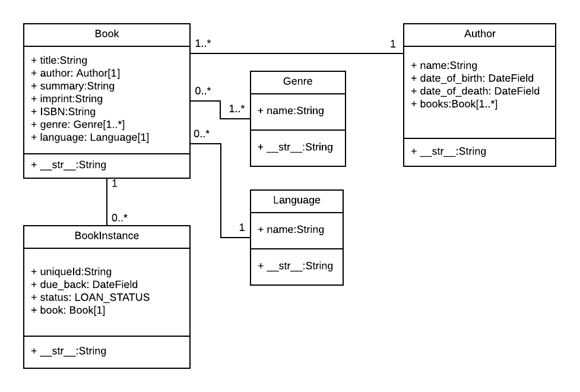

# 27 - Django Models and Admin

## [Models Tutorial](https://developer.mozilla.org/en-US/docs/Learn/Server-side/Django/Models)

Django web applications access and manage data through Python objects referred to as models. Models define the structure of stored data, including the field types and possibly also their maximum size, default values, selection list options, help text for documentation, label text for forms, etc. The definition of the model is independent of the underlying database; one of several can be chosen in a project's settings.

Django allows for defining relationships that are one to one (OneToOneField), one to many (ForeignKey) and many to many (ManyToManyField). An example UML association diagram follows:



The diagram shows the relationships between the models, including their multiplicities. The multiplicities are the numbers on the diagram showing the numbers (maximum and minimum) of each model that may be present in the relationship. For example, the connecting line between the boxes shows that Book and a Genre are related. The numbers close to the Genre model show that a book must have one or more Genres (as many as you like), while the numbers on the other end of the line next to the Book model show that a Genre can have zero or many associated books.

### Model Definition

Models are usually defined in an application's models.py file. They are implemented as subclasses of django.db.models.Model, and can include fields, methods and metadata. The code fragment below shows a "typical" model, named MyModelName:

```
from django.db import models

class MyModelName(models.Model):
    """A typical class defining a model, derived from the Model class."""

    # Fields
    my_field_name = models.CharField(max_length=20, help_text='Enter field documentation')
    ...

    # Metadata
    class Meta:
        ordering = ['-my_field_name']

    # Methods
    def get_absolute_url(self):
        """Returns the url to access a particular instance of MyModelName."""
        return reverse('model-detail-view', args=[str(self.id)])

    def __str__(self):
        """String for representing the MyModelName object (in Admin site etc.)."""
        return self.my_field_name
```

A model can have an arbitrary number of fields, of any type — each one represents a column of data to store in a database table.

The field name is used to refer to it in queries and templates. Fields also have a label specified as an argument (verbose_name), the default value of which is None, meaning replacing any underscores in the field name with a space (for example my_field_name would have a default label of my field name). Note that when the label is used as a form label through Django frame, the first letter of the label is capitalised (for example my_field_name would be My field name).

The order that fields are declared will affect their default order if a model is rendered in a form (e.g. in the Admin site), though this may be overridden.

### Common Field Arguments

The following common arguments can be used when declaring many/most of the different field types:

- help_text: Provides a text label for HTML forms (e.g. in the admin site), as described above.
- verbose_name: A human-readable name for the field used in field labels. If not specified, Django will infer the default verbose name from the field name.
- default: The default value for the field. This can be a value or a callable object, in which case the object will be called every time a new record is created.
- null: If True, Django will store blank values as NULL in the database for fields where this is appropriate (a CharField will instead store an empty string). The default is False.
- blank: If True, the field is allowed to be blank in your forms. The default is False, which means that Django's form validation will force you to enter a value. This is often used with null=True , because if you're going to allow blank values, you also want the database to be able to represent them appropriately.
- choices: A group of choices for this field. If this is provided, the default corresponding form widget will be a select box with these choices instead of the standard text field.
- primary_key: If True, sets the current field as the primary key for the model (A primary key is a special database column designated to uniquely identify all the different table records). If no field is specified as the primary key then Django will automatically add a field for this purpose.

[Full list of model field options.](https://docs.djangoproject.com/en/3.1/ref/models/fields/#field-options)

### Common Field Types

The following list describes some of the more commonly used types of fields. 

- CharField is used to define short-to-mid sized fixed-length strings. You must specify the max_length of the data to be stored.
- TextField is used for large arbitrary-length strings. You may specify a max_length for the field, but this is used only when the field is displayed in forms (it is not enforced at the database level).
- IntegerField is a field for storing integer (whole number) values, and for validating entered values as integers in forms.
- DateField and DateTimeField are used for storing/representing dates and date/time information (as Python datetime.date in and datetime.datetime objects, respectively). These fields can additionally declare the (mutually exclusive) parameters auto_now=True (to set the field to the current date every time the model is saved), auto_now_add (to only set the date when the model is first created) , and default (to set a default date that can be overridden by the user).
- EmailField is used to store and validate email addresses.
- FileField and ImageField are used to upload files and images respectively (the ImageField adds additional validation that the uploaded file is an image). These have parameters to define how and where the uploaded files are stored.
- AutoField is a special type of IntegerField that automatically increments. A primary key of this type is automatically added to your model if you don’t explicitly specify one.
- ForeignKey is used to specify a one-to-many relationship to another database model (e.g. a car has one manufacturer, but a manufacturer can make many cars). The "one" side of the relationship is the model that contains the "key" (models containing a "foreign key" referring to that "key", are on the "many" side of such a relationship).
- ManyToManyField is used to specify a many-to-many relationship (e.g. a book can have several genres, and each genre can contain several books). In our library app we will use these very similarly to ForeignKeys, but they can be used in more complicated ways to describe the relationships between groups. These have the parameter on_delete to define what happens when the associated record is deleted (e.g. a value of models.SET_NULL would set the value to NULL).

[Full list of model field types.](https://docs.djangoproject.com/en/3.1/ref/models/fields/#field-types)

### Metadata

Model-level metadata can be declared using class Meta, as shown.

```
class Meta:
    ordering = ['-my_field_name']
```

One of the most useful features of this metadata is to control the default ordering of records returned when you query the model type. You do this by specifying the match order in a list of field names to the ordering attribute, as shown above. The ordering will depend on the type of field (character fields are sorted alphabetically, while date fields are sorted in chronological order). As shown above, you can prefix the field name with a minus symbol (-) to reverse the sorting order.

So as an example, if we chose to sort books like this by default:

```
ordering = ['title', '-pubdate']
```

the books would be sorted alphabetically by title, from A-Z, and then by publication date inside each title, from newest to oldest.

Another common attribute is verbose_name, a verbose name for the class in singular and plural form:

```
verbose_name = 'BetterName'
```

Other useful attributes allow you to create and apply new "access permissions" for the model (default permissions are applied automatically), allow ordering based on another field, or to declare that the class is "abstract" (a base class that you cannot create records for, and will instead be derived from to create other models).

[Full list of model metadata options.](https://docs.djangoproject.com/en/3.1/ref/models/options/)


### Methods

A model can also have methods.

Minimally, in every model you should define the standard Python class method __str__() to return a human-readable string for each object. This string is used to represent individual records in the administration site (and anywhere else you need to refer to a model instance). Often this will return a title or name field from the model.

```
def __str__(self):
    return self.field_name
```

Another common method to include in Django models is get_absolute_url(), which returns a URL for displaying individual model records on the website (if you define this method then Django will automatically add a "View on Site" button to the model's record editing screens in the Admin site). A typical pattern for get_absolute_url() is shown below.

```
def get_absolute_url(self):
    """Returns the url to access a particular instance of the model."""
    return reverse('model-detail-view', args=[str(self.id)])
```

You can also define any other methods you like, and call them from your code or templates (provided that they don't take any parameters).

## [Django Admin Site](https://developer.mozilla.org/en-US/docs/Learn/Server-side/Django/Admin_site)

The Django admin application can use your models to automatically build a site area that you can use to create, view, update, and delete records. This can save you a lot of time during development, making it very easy to test your models and get a feel for whether you have the right data. The admin application can also be useful for managing data in production, depending on the type of website. The Django project recommends it only for internal data management (i.e. just for use by admins, or people internal to your organization), as the model-centric approach is not necessarily the best possible interface for all users, and exposes a lot of unnecessary detail about the models. 

### Registering Models

First, open admin.py in the catalog application (/locallibrary/catalog/admin.py). It currently looks like this — note that it already imports django.contrib.admin:

```
from django.contrib import admin

# Register your models here.
```

Register the models by copying the following text into the bottom of the file. This code imports the models and then calls admin.site.register to register each of them.

```
from .models import Author, Genre, Book, BookInstance

admin.site.register(Book)
admin.site.register(Author)
admin.site.register(Genre)
admin.site.register(BookInstance)
```

This is the simplest way of registering a model, or models, with the site. The admin site is highly customisable, and we'll talk more about the other ways of registering your models further down.

### Creating a Superuser

In order to log into the admin site, we need a user account with Staff status enabled. In order to view and create records we also need this user to have permissions to manage all our objects.  You can create a "superuser" account that has full access to the site and all needed permissions using manage.py.

Call the following command, in the same directory as manage.py, to create the superuser. You will be prompted to enter a username, email address, and strong password.

```
python3 manage.py createsuperuser
```

Once this command completes a new superuser will have been added to the database.

### Advanced configuration

Django does a pretty good job of creating a basic admin site using the information from the registered models:

Each model has a list of individual records, identified by the string created with the model's __str__() method, and linked to detail views/forms for editing. By default, this view has an action menu at the top that you can use to perform bulk delete operations on records.
The model detail record forms for editing and adding records contain all the fields in the model, laid out vertically in their declaration order.  
You can further customise the interface to make it even easier to use. Some of the things you can do are:

- List views:
  - Add additional fields/information displayed for each record. 
  - Add filters to select which records are listed, based on date or some other selection value (e.g. Book loan status).
  - Add additional options to the actions menu in list views and choose where this menu is displayed on the form.
- Detail views
  - Choose which fields to display (or exclude), along with their order, grouping, whether they are editable, the widget used, orientation etc.
  - Add related fields to a record to allow inline editing (e.g. add the ability to add and edit book records while you're creating their author record).
